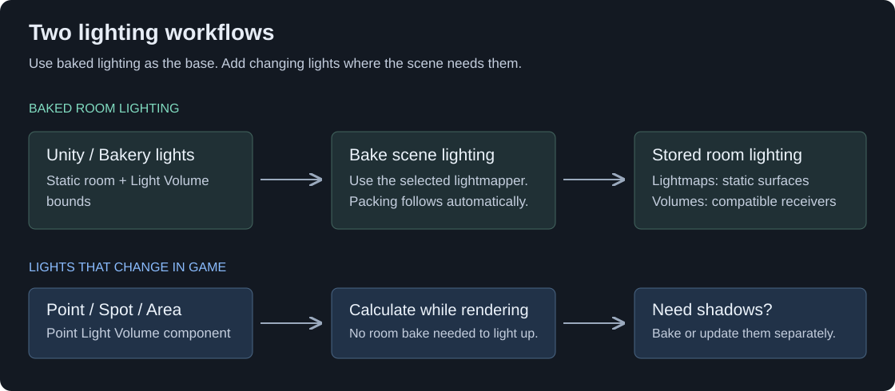

[VRC Light Volumes](../README.md) | **How to Use** | [Best Practices](./BestPractices.md) | [UdonSharp API](./UdonSharpAPI.md) | [Unity Editor API](./UnityEditorAPI.md) | [Shader Integration](./ForDevelopers.md) | [Compatible Shaders](./CompatibleShaders.md)

# How to Use

**Guides:** **Overview** · [Regular Light Volumes](./HowToUse_RegularLightVolumes.md) · [Point Light Volumes](./HowToUse_PointLightVolumes.md) · [Froxel Clustering](./HowToUse_FroxelClustering.md) · [Shadows](./HowToUse_Shadows.md) · [Material Sources](./HowToUse_PointLightMaterialSources.md) · [Area Light Emission](./HowToUse_AreaLightEmission.md) · [AudioLink](./HowToUse_AudioLinkIntegration.md) · [TV Screens (Older Workflow)](./HowToUse_TVScreensIntegration.md) · [Debugging](./HowToUse_Debugging.md) · [How It Works](./HowToUse_HowItWorks.md)

## Choose What You Need

VRC Light Volumes lights avatars and world objects through compatible materials. There are two main tools:

| I want to… | Use |
| --- | --- |
| Make avatars and moving props match a room's baked lighting | A **Regular Light Volume**. It stores the lighting throughout a box in the scene. |
| Add a light that can move, change color or turn on and off | A **Point Light Volume**, with Point, Spot or Area type. |
| Toggle or move a whole group of baked lights together | An **Additive Light Volume**. Start with the regular-volume guide, then its additive example. |
| Light my avatar in worlds that already use the system | Use a [compatible avatar shader](./CompatibleShaders.md). No avatar component is needed. |

For a typical world, keep baked lightmaps for the walls and floor, and add Regular Light Volumes for avatars and moving props. Lightmaps store lighting on a surface; Light Volumes store it throughout an area. You can use both.

A receiving object needs a [compatible shader](./CompatibleShaders.md), with Light Volumes enabled if that shader has an option for it. Unity's built-in Standard shader does not support the system. Avatars receive the world's lighting; installing the package in an avatar project does not turn the avatar into a world light source.

## Your First Baked Room

Install the package using the [installation instructions](../README.md), then try this example with Unity's built-in Progressive lightmapper. If your scene already has baked lighting, start at step 2.

### 1. Prepare The Scene Lighting

1. Place your room lights with `GameObject > Light > Point Light` or `Spot Light`. Use a Directional Light for sunlight. These are ordinary Unity Lights.
2. Set their **Mode** to **Baked** if they will stay in place. Put the lights where the visible lamps are, outside solid walls and ceilings.
3. Enable **Contribute GI** on the stationary walls, floor and other geometry that should participate in the bake. Keep **Receive Global Illumination** set to **Lightmaps** for surfaces that need lightmaps. Moving props should not be marked Contribute GI.
4. Open `Window > Rendering > Lighting`. Create a **Lighting Settings** asset if needed, enable **Baked Global Illumination**, and choose **Progressive CPU** or **Progressive GPU** as the lightmapper.
5. Save the scene.

Imported meshes need suitable lightmap UVs. If yours do not have them, enable **Generate Lightmap UVs** in their model import settings. See Unity's [lightmapping setup guide](https://docs.unity3d.com/2022.3/Documentation/Manual/Lightmapping.html) for the full scene setup.

### 2. Cover The Room With A Light Volume

1. Choose `GameObject > Light Volume`, or right-click in the Hierarchy and choose **Light Volume**.
2. Rename it after the area, such as `LV_LivingRoom`. Give each volume you bake a unique name.
3. Click **Edit Bounds** in its Inspector and resize the box to cover the space where avatars and props will be. Include their full height, not just the floor.
4. Leave **Bake** and **Adaptive Resolution** enabled. Start with the default **Voxels Per Unit** of `3`.
5. Click **Preview Voxels** to see where lighting will be stored. A voxel is one cell in this 3D grid. Smaller cells capture smaller lighting changes.

The first volume creates a **Light Volume Manager** automatically. Keep the Manager and its volumes in the same scene. Close other world scenes while setting up or baking: the system uses one Manager across the loaded scenes, and does not automatically assign volumes to a Manager in another scene.

### 3. Keep Lighting For Other Avatars

Before the first bake, create ordinary Unity Light Probes for avatars and materials that do not support Light Volumes. If the room already has a suitable Light Probe Group, keep it.

Select a Light Volume and click **Generate Light Probes**. Start with the lower density already shown in the window, then click **Create Light Probe Group**. Inspect the new group's points and move any that are inside walls or floors into open space.

### 4. Bake And Check The Result

1. Select the **Light Volume Manager** and set **Baking Mode** to **Progressive**.
2. In Unity's Lighting window, click **Generate Lighting**. Wait for the bake and the Light Volume processing to finish.
3. Select the volume. Its **Texture 0**, **Texture 1** and **Texture 2** fields should now be filled.
4. Create a material with `Assets > Create > Material`. In its **Shader** dropdown choose **Light Volume Samples > Light Volume PBR**, which comes with the package. Keep **Color** white and **Metallic** at `0`, and set **Smoothness** to `0` for this test.
5. Create a sphere with `GameObject > 3D Object > Sphere`, place it inside the box, and assign the material. Move it between bright and dark parts of the room: its surface should change color and brightness. The sphere should not be marked Contribute GI.
6. Test in Play Mode, then in a VRChat PC test build with a compatible avatar. For Android, test compatible world objects and ordinary probe lighting for avatars; see [PC And Android](./CompatibleShaders.md#pc-and-android). Check doorways and the edges of the volume as well as the center of the room.
7. Save the scene again.

The three test spheres sample the baked lighting across the blue and red parts of the room.

Inspector after baking

All three texture fields are filled. This example uses **3 Voxels Per Unit**, producing a **26 × 9 × 20** grid for this box size.

The bake saves the volume textures beside the scene and combines them into the Manager's **Light Volume Atlas**. You do not need to press **Pack Light Volumes** after a successful bake.

With **Bakery**, prepare the scene with Bakery lights, set the Manager's **Baking Mode** to **Bakery**, and run a normal Bakery full render. Follow any compatibility warnings shown in the Manager.

For more rooms, add volumes where needed. The [Regular Light Volumes guide](./HowToUse_RegularLightVolumes.md) explains density, overlap and room-to-room transitions.

## Add A Movable Light

Point Light Volumes work without a scene-lighting bake. Try one on a compatible material:

1. Create `GameObject > Point Light Volume`.
2. Set **Type** to **Point Light** for a bulb or **Spot Light** for a flashlight. Leave **Projection** set to **Parametric**.
3. Place the light, set **Light Source Size** to the approximate radius of its emitter, then adjust **Color** and **Intensity**.
4. Enable **Debug Range** and check that the light reaches only as far as needed.
5. If the light will move in game, enable **Dynamic** on it and **Auto Update Volumes** on the Manager.
6. If walls should block it, enable **Shadows > Enabled** and click **Bake Shadows**. This captures the light and geometry in their current positions. Moving the light or a blocker requires a new shadow capture; use a [runtime shadow baker](./HowToUse_Shadows.md#runtime-shadow-baker) if the shadows must follow movement in game.

**Intensity uses a different scale from Unity Lights.** Small emitters may need values in the hundreds or thousands. Judge the result on a nearby object instead of copying a Unity Light's value.

A light can change color or intensity without **Dynamic**. That setting controls movement. See [Point Light Volumes](./HowToUse_PointLightVolumes.md) for Area lights and projection, or [Shadows](./HowToUse_Shadows.md) for shadows that update in game.

## If Something Looks Wrong

Use the [debug views and avatar debugger](./HowToUse_Debugging.md) to inspect the lighting separately from a material's own appearance.

| Symptom | Check first |
| --- | --- |
| The floor is baked, but the test prop ignores Light Volumes | Its material needs a compatible shader. Check the shader's Light Volume option and that the prop is inside the volume. |
| A Regular Light Volume is dark or still shows old lighting | Confirm **Bake** is enabled, the Manager's **Baking Mode** matches your lightmapper, and the three texture fields are filled. Rebake after changing scene lights or volume bounds. |
| Only some avatars look different | Their shaders may lack support or apply their own brightness limits. Keep ordinary Light Probes for fallback lighting. |
| Lighting jumps in a doorway | Overlap the neighboring volumes and check their **Weight** and **Smooth Blending**. |
| A Point Light passes through a wall | Bake its shadows. A collider alone does not block its light. |
| A light moves in the Editor but stays still in game | Enable **Dynamic** and the Manager's **Auto Update Volumes**. |
| A scripted feature works in Edit Mode but disappears in Play Mode or a build | Check [Shader Stripping](./ForDevelopers.md#shader-feature-stripping); automatic detection cannot predict every runtime change. |

## Keep It Fast

- Bake stationary room lighting into Regular Light Volumes. Add Point Light Volumes where you need individual control.
- Start with a coarse grid and add smaller, denser volumes only where detail is missing. Doubling density on all three axes uses about eight times the data.
- Keep Point Light ranges tight and avoid many lights overlapping the same area.
- Prefer baked shadows. Continuous shadow baking is an extra rendering cost.
- Check the Manager's memory estimates and test on the intended device, especially Quest.

The active limits are **32 Light Volumes in total, including Additive volumes**, and **128 Point/Spot/Area Light Volumes**. You may have more in the scene if unused zones are disabled. See [Best Practices](./BestPractices.md) for tuning and [Froxel Clustering](./HowToUse_FroxelClustering.md) for scenes with many local lights.

## Updating An Existing Scene

Back up or commit the project before updating. Existing 2.x and earlier 3.0 development scenes migrate automatically when opened.

1. Open a scene and wait for migration and Udon compilation to finish.
2. Check the Console for warnings.
3. Inspect the Manager's lists and test several volumes, including moved, additive and shadowed lights.
4. Save the scene once the result is correct. Repeat for the other scenes you use.

The new **Light Volume Manager**, **Light Volume** and **Point Light Volume** Inspectors contain the settings that previously lived on separate helper components. Follow the current guides when updating scripts or prefabs.

If a migration warning says components were left unchanged, do not remove them to silence the warning. Keep the backup and resolve the reported missing or conflicting references before saving.
