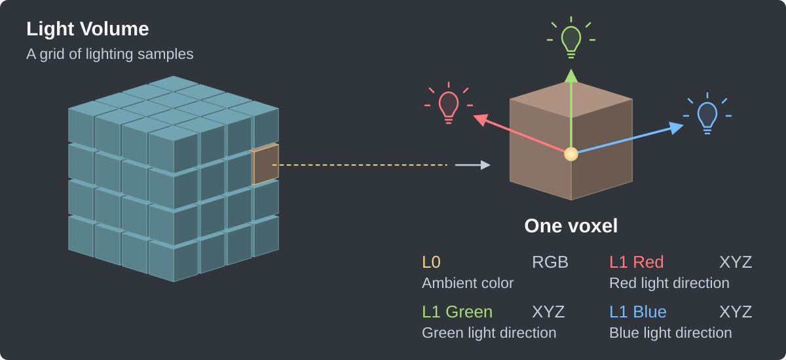
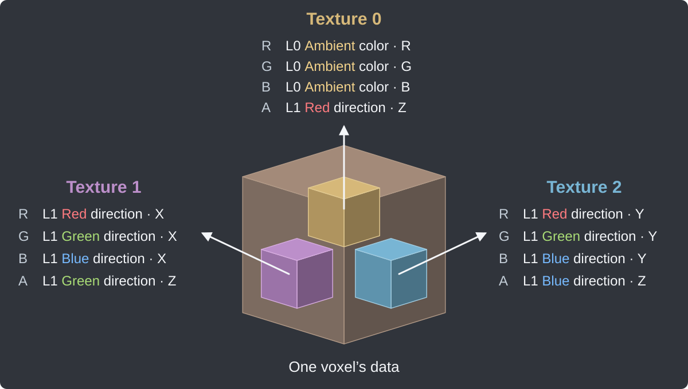
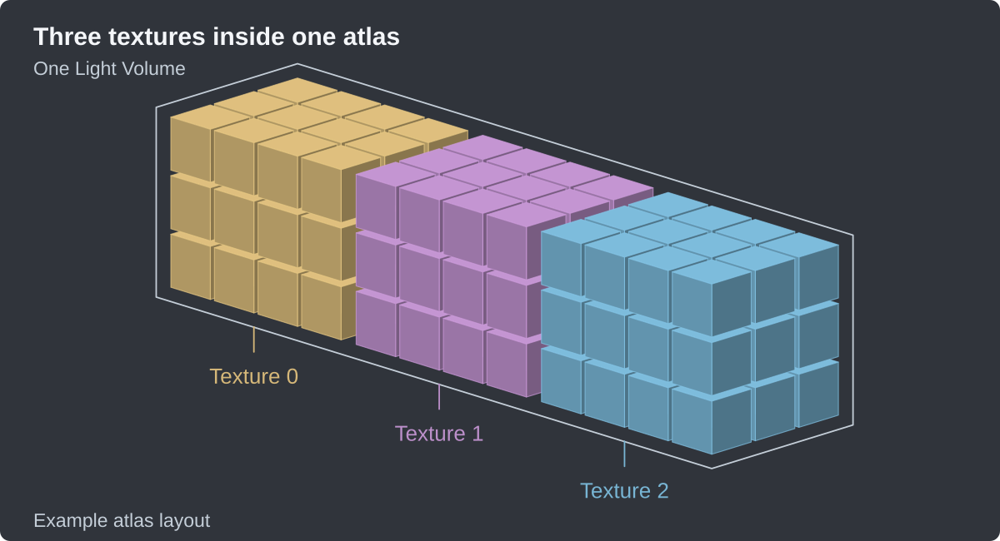
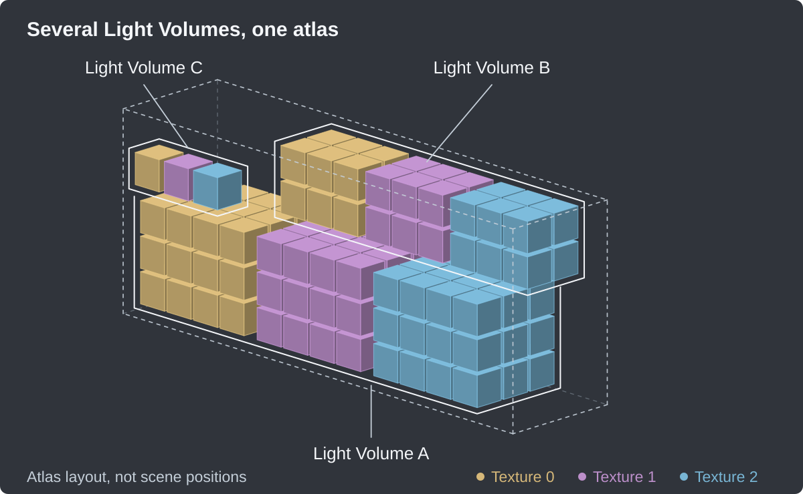
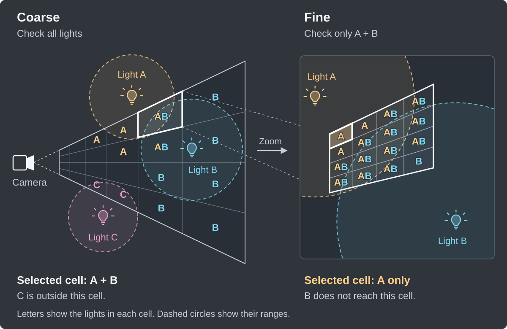
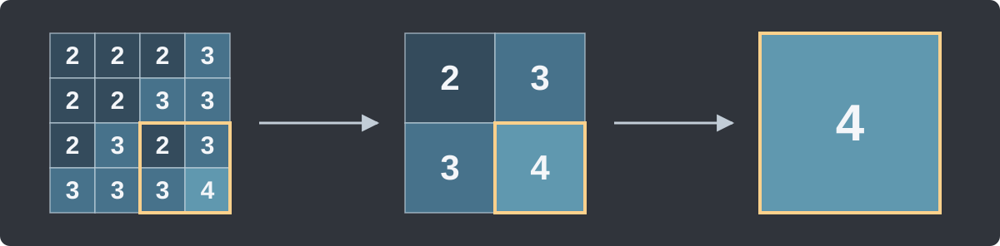
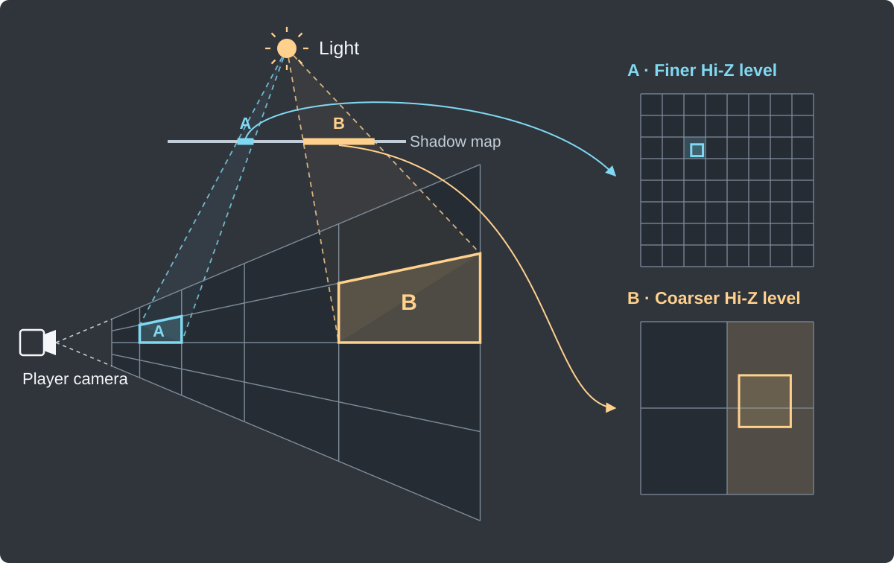

[VRC Light Volumes](../README.md) | **How to Use** | [Best Practices](./BestPractices.md) | [Scripting API](./ScriptingAPI.md) | [Shader Integration](./ForDevelopers.md) | [Compatible Shaders](./CompatibleShaders.md)

# How VRC Light Volumes Work

| Menu |
| --- |
| [Overview](./HowToUse.md) |
| [Regular Light Volumes](./HowToUse_RegularLightVolumes.md) |
| [Point Light Volumes](./HowToUse_PointLightVolumes.md) |
| [Froxel Clustering](./HowToUse_FroxelClustering.md) |
| [Shadows](./HowToUse_Shadows.md) |
| [Material Sources](./HowToUse_PointLightMaterialSources.md) |
| [AudioLink](./HowToUse_AudioLinkIntegration.md) |
| [TV Screens](./HowToUse_TVScreensIntegration.md) |
| [Debugging](./HowToUse_Debugging.md) |
| **How It Works**<br />• [Spherical Harmonics](#spherical-harmonics)<br />• [Light Data](#light-data)<br />• [Light Data Storage](#light-data-storage)<br />• [Light Volume Evaluation](#light-volume-evaluation)<br />• [Point Light Volumes](#point-light-volumes)<br />• [Froxel Clustering](#froxel-clustering)<br />• [EVSM Shadows](#evsm-shadows)<br />• [Shadow Culling (Hi-Z)](#shadow-culling-hi-z) |

This section is for developers and curious users who want to understand how Light Volumes work under the hood. You don't need to learn this to use them. Let's first look at Regular Light Volumes.

## Spherical Harmonics

**Spherical Harmonics (SH)** represent how light affects a point in space. Light Volumes uses **L1 Spherical Harmonics**: a rough approximation that is quick to calculate and works well for real-time lighting.

The L1 SH data consists of:

- **L0** — Ambient color. The average light color at a point, with no directional information.
- **L1 Red** — Directional information for red light. A vector pointing toward the average direction the red light comes from. Its length describes how strongly that lighting varies with direction.
- **L1 Green** — The same directional information for green light.
- **L1 Blue** — The same directional information for blue light.

For example, equally bright lights from opposite directions can cancel each other's L1 vectors while L0 stays bright. SH stores the combined lighting, not a list of individual lights.

## Light Data

Light Volumes are 3D textures made of **voxels**: essentially 3D pixels, like blocks in Minecraft. Each voxel has RGBA channels, just like a pixel in a 2D texture. Here, those channels store lighting data rather than an ordinary image color.

Each Light Volume holds this data for a 3D grid of positions in the world. Higher resolution captures smaller changes in lighting, just as a higher-resolution 2D texture captures smaller details.



The arrows show the L1 vectors for red, green and blue. They describe the average incoming light direction for each color.

## Light Data Storage

An RGBA texture has four channels per voxel, but SH L1 needs **12 values**: three for the ambient color and three for each of the red, green and blue direction vectors.

The bake therefore writes **three separate 3D textures**, each holding four of those values:



**Pack Light Volumes** combines the three textures into one **3D texture atlas**. Think of it as placing several smaller blocks inside one large texture. Padding around each block repeats its edge values, so texture filtering does not mix unrelated blocks.



When a scene has multiple Light Volumes, their texture blocks are packed into the same atlas. The shader can then read lighting for different volumes from one shared texture.



## Light Volume Evaluation

Reading the atlas and evaluating its lighting happens entirely in the shader. That is why materials need a shader that supports VRC Light Volumes.

Along with the atlas, the system provides **3D texture coordinates (UVW)** that map positions in the world to the correct part of the atlas. For each surface pixel, the shader finds that position and interpolates lighting from nearby voxels.

After reading L0 and L1, it uses the surface's **normal** — the direction the surface faces — to calculate the lighting. For each red, green and blue channel, the basic formula is:

```glsl
Lighting = L0 + dot(L1, WorldNormal);
```

The dot product makes the directional contribution stronger when the surface faces the incoming light. The material then uses this lighting together with its own color and shading.

Regular Light Volumes complement Unity Light Probes. Keep ordinary probes too: they provide fallback lighting and support materials without Light Volumes integration.

## Point Light Volumes

Point Light Volumes also use SH L1 to describe lighting, but don't store it in voxels. Instead, they calculate it in real time from the surface position and the light's shape, size, color and intensity.

Each light type has its own calculation. A **Parametric Point light** uses inverse-square falloff, softened near the source by its physical size:

```math
Attenuation = \frac{1}{\text{LightSize}^2 + \text{DistanceToLight}^2}
```

Its light color, before shadows and material shading, is:

```math
LightColor = \text{Attenuation} \times \text{Color} \times \text{Intensity} \times \text{LightSize}^2
```

Here, **LightSize** is the physical source size after object scale. Multiplying by its square makes **Intensity** behave more like light emitted per unit surface area than total emitted energy. A larger source emits more light at the same intensity.

To stop calculating the light beyond its range, the shader also applies a distance mask:

```math
Mask = \text{Saturate}\left(1 - \frac{\text{DistanceToLight}^2}{\text{CutoffDistance}^2}\right)
```

`Saturate()` clamps the value between 0 and 1. Multiplying the light color by `Mask²` fades it to zero at the cutoff distance.

Spot lights add a cone to this falloff. Area lights use a different calculation based on the rectangle's size, orientation and position. A cookie can add a pattern or image to the light. The resulting SH data combines with the baked volume lighting before the material evaluates it.

## Froxel Clustering

A **froxel** is a small 3D cell inside the camera's viewing volume, called the **frustum**. **Froxel Clustering** divides this space into a grid and records which Point, Spot and Area lights could reach each cell. This grid follows the camera; it does not store baked lighting like a Regular Light Volume.

The grid is built in two stages:

- **Coarse** checks all lights against large cells. Each cell keeps a list of possible lights.
- **Fine** checks the smaller cells inside each Coarse cell, using only the lights that passed the first check.

When shading a surface, the shader finds its froxel and evaluates only the lights on that cell's final list. The two stages avoid checking every light against every small cell.



Clustering usually reduces shading work when many lights occupy different parts of a scene. Lights that overlap heavily still share long lists. Building the grid also takes GPU time, so check performance with your scene and grid resolution. See [Froxel Clustering](./HowToUse_FroxelClustering.md) for settings and debug views.

## EVSM Shadows

**EVSM** stands for **Exponential Variance Shadow Maps**. It produces soft shadows from the distances recorded in a shadow map. Two exponential conversions emphasize different parts of the distance range: one near the light, the other farther away.

Both sets of values are blurred while retaining their average and variation (**variance**). The shader compares each surface's distance with this data to estimate how much light reaches it. It keeps the **darker of the two estimates** to reduce light leaks. The blur creates the soft shadow edge, or **penumbra**.

Capture and blur happen during the bake; **Realtime** shadows repeat this work during play. EVSM is approximate, so some light can still leak through. **Shadow Bleed Reduction** helps suppress it. See [Shadows](./HowToUse_Shadows.md) for the controls.

## Shadow Culling (Hi-Z)

**Shadow Culling** skips a light in froxels that are fully inside its shadow. **Hi-Z** means **Hierarchical Z Buffer**: several levels of shadow data, with each level covering larger regions. These levels belong to the light's shadow map. Both the **Coarse** and **Fine** clustering stages use them to check their froxels.

### Building Hi-Z

Light Volumes builds Hi-Z from the filtered EVSM shadow map. Each level combines **2 × 2** cells from the previous level, keeping their **largest value**. Repeating this covers larger areas with fewer values.



In the diagram above, the numbers are distances from the light in **metres**. Beyond each distance, that part of the shadow map is fully in shadow. The same area is shown with **16 values**, then **4**, then **1**.

The final **4** means the whole area is in shadow beyond **4 metres** from the light.

### Choosing A Hi-Z Level

In a perspective camera, froxels get wider with distance. To check one against a light's shadow, clustering looks at the whole froxel from the light and finds the area it covers in that light's shadow map.

A small projected area uses a **finer Hi-Z level**; a larger area uses a **coarser level**. Both the froxel's size and its position relative to the light affect this choice.



Both grids on the right show the same shadow map at different levels. Colored outlines show the froxel projections; shaded cells contain the values read for each check. A projection can cross cell boundaries: **B** covers two cells, so both values must be checked.

Clustering compares the froxel's closest distance from the light with these values. If even the closest point is beyond all of them, the whole cell is in shadow and the light can be skipped. For example, a closest point at **6 m** is beyond a **4 m** shadow limit. Cells that could still receive light keep the light for normal shading.

This saves the most work when walls, floors or ceilings block large parts of a light's range. **Shading Strength** must be **1**, and lights with **Realtime** shadow updates do not use Hi-Z. See [Shadow Culling settings](./HowToUse_FroxelClustering.md#shadow-culling-hi-z).
