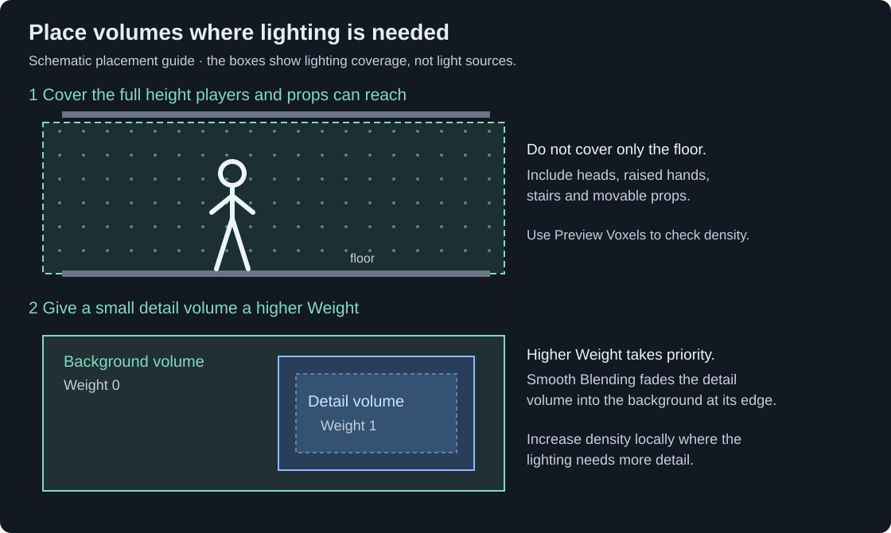

[VRC Light Volumes](../README.md) | [How to Use](./HowToUse.md) | [Best Practices](./BestPractices.md) | [UdonSharp API](./UdonSharpAPI.md) | [Unity Editor API](./UnityEditorAPI.md) | [Shader Integration](./ForDevelopers.md) | [Compatible Shaders](./CompatibleShaders.md)

# Regular Light Volumes

**Guides:** [Overview](./HowToUse.md) · **Regular Light Volumes** · [Point Light Volumes](./HowToUse_PointLightVolumes.md) · [Froxel Clustering](./HowToUse_FroxelClustering.md) · [Shadows](./HowToUse_Shadows.md) · [Material Sources](./HowToUse_PointLightMaterialSources.md) · [Area Light Emission](./HowToUse_AreaLightEmission.md) · [AudioLink](./HowToUse_AudioLinkIntegration.md) · [TV Screens (Older Workflow)](./HowToUse_TVScreensIntegration.md) · [Debugging](./HowToUse_Debugging.md) · [How It Works](./HowToUse_HowItWorks.md)

A Regular Light Volume stores a baked lighting grid inside a box. A compatible shader reads the grid at each part of an avatar or object, so its feet, face and hands can receive different lighting.

Use regular volumes for rooms, outdoor areas and other stationary lighting. They do not create light on their own: set up your Unity or Bakery lights, then bake. If this is your first setup, follow [Your First Baked Room](./HowToUse.md#your-first-baked-room).

## Place Volumes Where Objects Need Lighting

Cover the space occupied by avatars and props, including head height, stairs, balconies and places where a player may jump. Covering only a thin layer above the floor leaves the rest of an avatar outside the volume.

A practical starting layout is:

1. One large, low-density volume for an open area with soft lighting.
2. Smaller volumes for rooms with different lighting or stronger shadows.
3. Slight overlaps at doorways and other transitions.

For example, keep the large outdoor volume at **Weight** `0` and give the detailed room volume **Weight** `1`. Set these values in the Manager's **Light Volumes** list. Higher weight has priority wherever the boxes overlap.

**Smooth Blending** controls the width of the transition at a volume's edges, in meters. Make the overlap wider than the blend region; for example, overlap by `0.5 m` with **Smooth Blending** set to `0.25`. Check the result on a moving prop.

To blend from a volume into an uncovered area, keep **Light Probes Blending** enabled and disable **Sharp Bounds** on the Manager. This softens all outer edges, so extend the volume beyond the area that needs its full lighting.

> [!TIP]
> If you create a Light Volume as a child of a Reflection Probe, it starts with that probe's bounds. You can then resize it independently.

### Edit The Bounds

Use **Edit Bounds** and drag the face handles, or use Unity's Transform tools. While dragging a bounds handle:

- Hold **Alt** (Option on macOS) to resize both opposite faces.
- Hold **Shift** to keep the box's proportions while resizing.

Moving or resizing a baked volume moves or stretches its stored lighting. Rebake after changing the bounds when the volume should still match the stationary room.

## Choose A Useful Resolution

A **voxel** is one cell in the lighting grid. With **Adaptive Resolution** enabled, **Voxels Per Unit** sets the number of cells along one meter.

| Density | Approximate cell width | A starting use |
| --- | --- | --- |
| `1` | `1 m` | Large areas with very soft lighting |
| `3` | `0.33 m` | First pass for a room |
| `6` | `0.17 m` | A small area where the first bake loses important detail |

These are starting points. Bake, move a test prop through the lighting, and increase density only where the result is too coarse.

A `10 × 3 × 10 m` box at `3` voxels per unit has a `30 × 9 × 30` grid: `8,100` voxels. Raising the density to `6` produces `64,800` voxels—eight times as many.

Use **Preview Voxels** to inspect the grid and watch **Size in VRAM** and **Size in bundle**. A smaller dense volume around a doorway or sharp shadow is usually more economical than increasing the resolution of the whole world.

## Bake And Reuse The Data

1. Save the scene and give each volume you will bake a unique GameObject name.
2. Choose **Progressive** or **Bakery** under the Manager's **Baking Mode**.
3. Enable **Bake** on each volume that should receive new lighting.
4. Run **Generate Lighting** in Unity's Lighting window, or a normal Bakery full render.
5. Wait for **Texture 0**, **Texture 1** and **Texture 2** to update, then inspect the result.

The system packs the textures into a shared atlas automatically after a successful bake. **Pack Light Volumes** only combines existing data; it does not recalculate scene lighting. Use it after bringing already-baked volume data into another scene or when you need to rebuild the atlas manually.

Disable **Bake** to preserve a volume's existing textures during later scene bakes. Keep those source assets in the project: future atlas rebuilds still need them.

## Generate Fallback Light Probes

Ordinary Unity Light Probes keep avatars and materials without Light Volume support lit. They also supply lighting outside volume bounds when **Light Probes Blending** is enabled.

1. Select a volume and click **Generate Light Probes**.
2. Start with the lower density offered in the window.
3. Click **Create Light Probe Group**.
4. Select the new child object and edit its points. Move points inside solid walls or floors into open space; add points around important changes in lighting.
5. Bake the scene again.

The button creates probe positions, not baked lighting. The generated group is a separate, editable Light Probe Group and does not automatically follow later changes to the volume's resolution. See Unity's [probe placement guide](https://docs.unity3d.com/2022.3/Documentation/Manual/LightProbes-Placing-Scripting.html) for placement principles.

## Additive Light Volumes

An **Additive** volume adds its baked lighting on top of the base lighting. It can also light static lightmapped surfaces when their shader supports additive volumes.

Use one for a baked group of lights that should switch, change color or move together. For a single flashlight or lamp, a Point Light Volume is usually easier to set up.

### Example: A Switchable Group Of Lamps

Bake the lamps separately so their light is not already present in the main scene's lightmaps:

1. Save a copy of the scene for the additive bake. Open it on its own.
2. Keep the room geometry, but disable lights and emissive lighting that do not belong to the switchable group. Remove any unwanted environment lighting from this bake as well.
3. Place a Light Volume around the area the lamps illuminate. Let the light fade before the box ends so the edge is not visible.
4. Bake the lighting. Check that the volume contains only the lighting you want to toggle.

Then use that result in the main scene:

1. Preserve the baked volume as a prefab, or copy its GameObject, and bring it into the main scene. Keep the generated texture assets.
2. Enable **Additive** and disable **Bake** on this volume. Check that it appears in the main scene's Manager list.
3. Bake the main scene with the switchable lamps' bake lights disabled. Otherwise their lighting will remain visible when the additive volume is off.
4. Click **Pack Light Volumes** after importing the volume if the main scene has not been baked again.
5. Toggle the additive volume's GameObject to test the off/on result.

You can also use `SetColor()` and `SetIntensity()` through the [UdonSharp API](./UdonSharpAPI.md). Enable **Dynamic** and the Manager's **Auto Update Volumes** only if the volume itself will move.

Moving an additive volume moves its stored light and shadows together. The bake will not learn about a wall that was not present when it was created. Use [Point Light Volume shadows](./HowToUse_Shadows.md) when you need a separate shadow workflow.

## Match Brightness Without Rebaking

Use **Color** and **Intensity** for a simple tint or brightness multiplier.

The **Color Correction** controls adjust the baked data:

- **Exposure** makes the whole result brighter or darker.
- **Shadows** changes the darker values.
- **Highlights** changes the brighter values.

These can help match a volume to the room's lightmaps or remove a slight unwanted ambient glow from an additive bake. They do not fix missing light or shadows; correct the lights or bake settings when the source bake is wrong. Changing baked-data correction rebuilds the atlas.

## Inspector Reference

| Parameter | What to use it for |
| --- | --- |
| **Edit Bounds** | Resize the volume with face handles in the Scene view. |
| **Preview Voxels** | Show the lighting grid and, after baking, its stored lighting. |
| **Size in VRAM / Size in bundle** | Estimate texture memory and compressed build size. |
| **Dynamic** | Allow the stored lighting to move with the Transform in game. Also enable the Manager's **Auto Update Volumes**, or update the Transform through the API. |
| **Additive** | Add this lighting on top of the base lighting. |
| **Color / Intensity** | Tint or scale the volume's lighting. |
| **Weight** (Manager list) | Give higher values to volumes that should take priority in overlaps. |
| **Smooth Blending** | Width of the edge transition, in meters. |
| **Texture 0 / 1 / 2** | The three source textures produced by a bake. Keep them for future atlas rebuilds. |
| **Exposure / Shadows / Highlights** | Adjust the brightness of the baked data. |
| **Bake** | Include this volume in the next supported lightmapper bake. Disable it to preserve existing textures. |
| **Reserve UV Space** | With **Bake** disabled, reserve a blank part of the atlas for a custom texture-processing setup. Leave off for normal baked volumes. |
| **Adaptive Resolution** | Calculate grid resolution from box size and **Voxels Per Unit**. |
| **Voxels Per Unit** | Set grid density along each meter. |
| **Resolution** | X/Y/Z cell counts. Disable **Adaptive Resolution** to control these manually. |

**Limits:** Regular and Additive Light Volumes share a limit of **32 active volumes**. Disable unused zones if the scene contains more. Froxel Clustering applies to Point Light Volumes and does not reduce regular-volume sampling cost.
