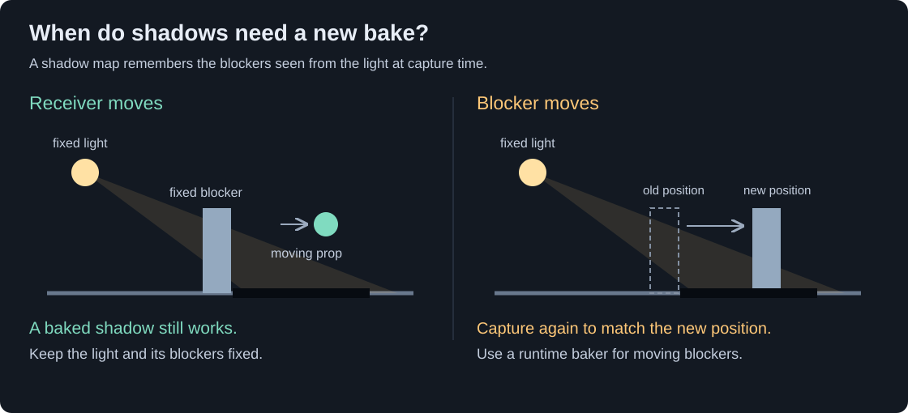

[VRC Light Volumes](../README.md) | [How to Use](./HowToUse.md) | [Best Practices](./BestPractices.md) | [Scripting API](./ScriptingAPI.md) | [Shader Integration](./ForDevelopers.md) | [Compatible Shaders](./CompatibleShaders.md)

# Point Light Volume Shadows

| Menu |
| --- |
| [Overview](./HowToUse.md) |
| [Regular Light Volumes](./HowToUse_RegularLightVolumes.md) |
| [Point Light Volumes](./HowToUse_PointLightVolumes.md) |
| [Froxel Clustering](./HowToUse_FroxelClustering.md) |
| **Shadows**<br />• [Choose A Shadow Mode](#choose-a-shadow-mode)<br />• [Bake A Fixed Lamp](#bake-a-fixed-lamp)<br />• [Get The Shadow Coverage Right](#get-the-shadow-coverage-right)<br />• [Fix Common Artifacts](#fix-common-artifacts)<br />• [Resolution And Memory](#resolution-and-memory)<br />• [Bake In Game](#bake-in-game)<br />• [Runtime Shadow Baker](#runtime-shadow-baker)<br />• [Scripted And External Sources](#scripted-and-external-sources) |
| [Material Sources](./HowToUse_PointLightMaterialSources.md) |
| [Area Light Emission](./HowToUse_AreaLightEmission.md) |
| [AudioLink](./HowToUse_AudioLinkIntegration.md) |
| [TV Screens (Older Workflow)](./HowToUse_TVScreensIntegration.md) |
| [Debugging](./HowToUse_Debugging.md) |
| [How It Works](./HowToUse_HowItWorks.md) |

Point, Spot and Area lights can cast shadows onto surfaces with a [compatible shader](./CompatibleShaders.md). Baked shadows work on moving props and avatars. Bake again when the light or a shadow-casting object moves.


Look at the long column shadows across the floor and the frame-shaped shadow around the orange lamp on the right.

## Choose A Shadow Mode

| Mode | Use it for |
| --- | --- |
| No shadows | Decorative lights with no visible blockers. |
| **Bake Shadows** in the Editor | A fixed lamp and stationary walls or furniture. Color and brightness can still change. |
| **Bake In Game** | One shadow bake when the light first starts in game. |
| Runtime baker **Bake On Enable** | Fresh shadows each time the baker is activated. |
| Runtime baker **Realtime** | Moving lights or shadow casters. This is the most expensive option. |

Use editor-baked shadows for fixed lights. Use continuous updates only where the changing shadow is visible and worth the cost.

## Bake A Fixed Lamp

1. Select the **Point Light Volume**. Under **Shadows**, turn on **Enabled**.
2. Leave **Resolution** at **Manager - …** to inherit the Manager's **Shadow Resolution**, or choose a per-light resolution.
3. Set **Layer Mask** to the layers that should cast the shadow.
4. Add any individual objects to **Excluded Renderers** if they should not block this light. Drag their Renderer components; adding a parent does not exclude all its children. For example, exclude the bulb mesh or screen surface if it blocks its own light.
5. Leave **Far Plane** at `0 (Auto)` initially. Enable **Debug Clip Planes** to see the camera's near/far limits.
6. Press **Bake Shadows**. Check the wall or floor behind a blocker: its shadow should now be visible.
7. Adjust **Bias** if surfaces shadow themselves, or **Blur** for softer edges, then bake again.

Bake again after moving the light or blockers, or changing Layer Mask, clip planes, Bias, Blur, Contact Hardening or Spherical Blur.



Move a test prop with a compatible material through the baked shadow. Its lighting should change without another bake, as long as the light and the captured blockers stay fixed.

The Manager's **Bake Shadows** button processes lights with shadows enabled and **Rebake Shadows** checked. Uncheck Rebake Shadows to keep one light's existing map during a batch bake. **Clear Shadows** on a light removes its assigned map without deleting the source asset.

## Get The Shadow Coverage Right

A normal **Spot Light** uses one projected shadow view. **Point** and **Area Lights** use six cubemap views. **Force Cubemap Shadows** also makes a Spot use six views.

A narrow Spot angle gives sharper shadows from a single view. Consider **Force Cubemap Shadows** for wide angles of around `120°` or more. At `180°` or more, enable it to cover the full cone.

Keep **Near Plane** small enough to include nearby blockers. **Far Plane** sets the farthest distance captured; `0 (Auto)` uses the light's range. Set a distance yourself if the light starts black or at zero intensity.

Enable **Use World Space** to keep the baked shadow at its original position and rotation. Leave it off to move the shadow with the light. Either way, rebake when the shadow needs to match changed geometry.

## Fix Common Artifacts

| Symptom | What to try |
| --- | --- |
| A wall or prop casts no shadow | Check Layer Mask, Excluded Renderers, clip planes and that the object's material can render into the shadow camera's depth. Re-bake after changes. |
| Speckles or striped self-shadowing | Increase **Bias** a little and re-bake. Too much bias detaches the shadow from its caster. |
| Shadow floats away from an object | Reduce Bias. Also check excessive variance or blur. |
| Jagged edges | Try more **Blur** or a higher resolution. A narrower Spot angle may use the same texture more effectively. |
| Cubemap seams or uneven blur | Enable **Spherical Blur** and re-bake. It costs more during baking than planar blur. |
| Light leaks through shadowed areas | Increase Manager **Shadow Bleed Reduction** cautiously; strong values can remove faint shadow detail. |
| Moving objects leave old shadows | Use a fresh bake or the runtime baker; editor-baked shadows do not track moving casters. |
| Shadows disappear when Shading Strength is lowered | This control also reduces shadow strength; `0` disables the shadow contribution. |

**Contact Hardening** makes shadows sharper close to contact. Leave it at `0` until the basic shadow looks correct; it adds processing cost and can introduce artifacts.

### PC And Quest

Check shadows on the target device: mobile builds can show artifacts that aren't visible in a PC preview.

Start with the mobile **Shadow Min Variance** default of `1`. Try **Shadow Bleed Reduction** around `0.2–0.4` if needed. You can adjust these Manager settings without rebaking; changing **Bias** needs another bake.

## Resolution And Memory

Start with **Resolution → Manager**. Choose `16`–`2048` on an individual light when it needs a different bake resolution. Lower values make bakes faster but can lose detail.

The Manager's **Shadow Resolution** sets the resolution used in game for all shadows. A per-light override only changes the bake resolution.

**Quality** controls blur and contact-hardening quality for in-game bakes. It doesn't change resolution. **Spherical Blur** affects both Editor and in-game bakes.

## Bake In Game

Enable **Bake In Game** on the light. It bakes once when the object first starts or becomes active. Re-enabling it later doesn't bake again.

You can still use **Bake Shadows** in the Editor for a preview. The Editor-baked map is left out of the world download, but the runtime map still uses GPU memory. Test startup on the target device: lights bake one per frame, but a Point or Area light still captures all six views in one frame. A bake can cause a brief stutter.

Keep the light and Manager active until the bake finishes. For spawned lights, assign the Manager before their first activation. Use the runtime baker for repeat bakes, or see the [UdonSharp API](./ScriptingAPI.md#runtime-shadow-baking) for retries.

## Runtime Shadow Baker

1. Add **Point Light Shadow Runtime Baker** and assign **Target Point Light Volume**.
2. Enable shadows on that light and configure its caster, clip, resolution and blur settings.
3. Choose **Bake On Enable** for activation-time bakes, or **Realtime** for continuous updates. Realtime takes priority.
4. For a moving light, also enable the light's **Dynamic** and Manager **Auto Update Volumes**.
5. Enter Play Mode to check it. Continuous runtime baking is not an Edit Mode Scene-view preview.

Use only one baking workflow on a light at a time; turn off its **Bake In Game** when the external baker owns startup.

To keep a shadow after Realtime stops, call `BakeShadows()` once on your assigned `PointLightShadowRuntimeBaker`, here named `ShadowBaker`:

```csharp
ShadowBaker.BakeShadows();
```

> [!WARNING]
> Keep realtime Point and Area shadows to a small number of important lights. Reducing caster geometry, resolution and blur work is usually more useful than trying to update many six-face lights continuously.

## Scripted And External Sources

For an occasional scripted bake, call `BakeShadows()` on your assigned `PointLightVolumeInstance`, here named `Lamp`. Follow the [UdonSharp setup requirements](./ScriptingAPI.md#runtime-shadow-baking) first:

```csharp
Lamp.BakeShadows();
```

If scripts enable shadows absent from the authored scene, retain the needed features in Manager **Shader Stripping** settings.

For a custom **Shadow Map**, follow the [shader requirements and example](./TechnicalDetails.md#shadow-map-materials). An ordinary black-and-white mask or camera-depth texture will not work.
